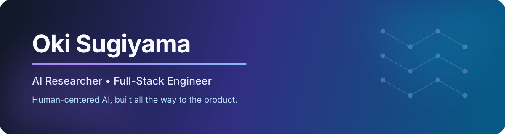

  

  <a href="https://www.okisugiyama.com/">Portfolio</a> ·
  <a href="https://www.linkedin.com/in/oki-sugiyama634/">LinkedIn</a> ·
  <a href="https://corallab.net/people">CORAL Lab</a>

## Building intelligent systems that feel useful, human, and real

I'm a Computer Science and Mathematics student at Purdue University working at the intersection of **AI research** and **product engineering**. My work spans emotion-aware computer vision, recommendation systems, real-time applications, and full-stack products that people can use—not just prototypes that live in a notebook.

I care about the full path from an idea to evidence: defining the problem, building the model or system, measuring it, and shipping an experience around it.

## Selected work

| Project | What I built | Engineering highlights |
| --- | --- | --- |
| [**BookAIReview**](https://www.okisugiyama.com/projects/reviews) · [Live product](https://bookaireview.okisugiyama.com/) | A social book-discovery platform with hybrid personalized recommendations. | LightGCN and content-based recommendations, Django REST Framework, React, PostgreSQL, and AWS ECS. |
| [**Emotional Friend**](https://www.okisugiyama.com/projects/emotional-friend) · [Live demo](https://emotionalfriendchatbot.okisugiyama.com/) | An emotion-aware conversational experience that adapts to facial expressions in real time. | PyTorch computer vision, WebRTC, React, TypeScript, Firebase, and privacy-conscious controls. |
| [**Lemon Discharger**](https://www.okisugiyama.com/projects/game) · [Play](https://lemondischargergame.okisugiyama.com/) | A fast-paced multiplayer strategy game with 1.5-second turns. | React, TypeScript, Socket.IO, server-side validation, reconnection, and synchronized game state. |

## What I work with

**AI and data:** Python, PyTorch, computer vision, recommendation systems, OpenCV, pandas, NumPy  
**Product engineering:** TypeScript, React, Next.js, Django, Node.js, REST APIs, WebSockets  
**Infrastructure:** PostgreSQL, Firebase, AWS, Docker, Git

## What I'm exploring now

- Human-centered and emotion-aware AI
- Reliable AI features inside production applications
- Real-time systems where correctness and user experience meet
- Research and engineering opportunities in AI/ML and software development

## Let's connect

I'm always glad to talk about thoughtful research, ambitious products, and technology that improves people's lives.

  <a href="https://www.okisugiyama.com/"><strong>Explore my work →</strong></a>

